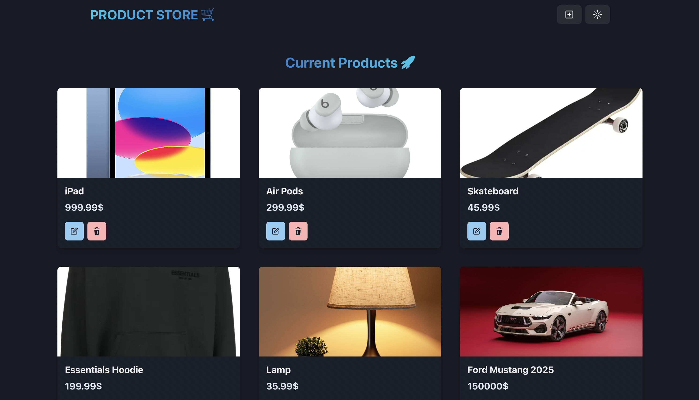

# 🛒 Product Marketplace  

A full-stack **MERN** application for buying and selling products. Users can add, update, and delete products dynamically, with real-time updates reflected in the frontend.

🔗 **Live Demo:** [Product Marketplace](https://product-marketplace.onrender.com)

---

## 🚀 Technologies Used  
- **Frontend:** React, Chakra UI  
- **Backend:** Node.js, Express.js  
- **Database:** MongoDB, Mongoose  
- **State Management:** Zustand  
- **Hosting:** Render  

---

## 📌 Description  
The **Product Marketplace** is a full-stack application built using the **MERN** stack. It features:  
✅ **RESTful API endpoints** that interact with MongoDB to perform **CRUD operations** (Create, Read, Update, Delete).  
✅ **Dynamic frontend** with React that updates automatically when products are added, modified, or deleted.  
✅ **State management with Zustand**, ensuring seamless UI updates.  
✅ **Hosted online** for live interaction with the database (May be down due to free service limits, can reboot on request).  

---

## 🖼️ Project Preview  

